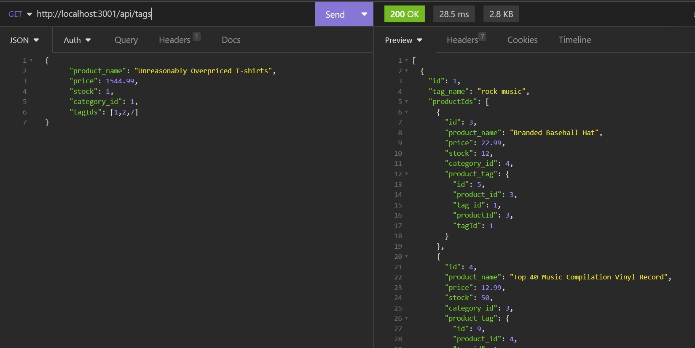

# Retail-Shop-Back-End
A back end for an internet retail shopping site, built with Node, Express, MySQL, and Sequelize

A video demo of the app can be found [here](https://drive.google.com/file/d/1_TtTdG9dwiYl8jtj4jOGKdyj1SLawgtn/view)

## Screenshot

## Features

- Built with Node, Express, MySQL, and Sequelize
- User can create POST, PUT, and DELETE requests for various tables in this particular e-Commerce database
- They can view all the contents or just one entry via a unique ID, of various tables such as Category, Products, and Tags

## Table of Contents 

* [Installation](#installation)

* [Usage](#usage)

* [License](#license)

* [Contributing](#contributing)

* [Tests](#tests)

* [Questions](#questions)

## Installation

To install necessary dependencies, run the following command:
~~~
npm i
~~~

Insert mySQL database's name, user's name, password into the connection.js file directly or via dotenv

Run schema.sql

To seed the database, run the follow command:
~~~
npm run seed
~~~

## Usage

Perform a git clone and run the code with "npm start"

Recommended softwares: 
- MySQL Workbench to see database changes
- Insomnia to view back end routes

## License

MIT

## Contributing

Fork the repo and create pull requests

## Tests

To run tests, run the following command:
~~~
npm test
~~~
## Questions

If you have any questions about the repo, open an issue or contact me directly at Algarvian2001@yahoo.com. You can find more of my works at [NganPham89](https://github.com/NganPham89).
